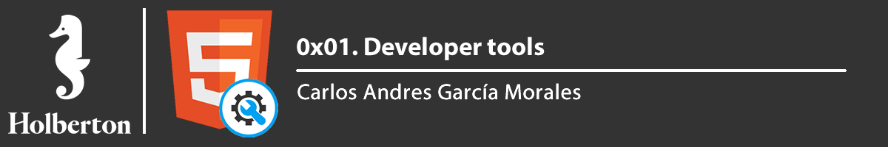




# Requirements

> - A README.md file at the root of the folder of the project is mandatory
> - Use the newest version of Google Chrome browser (78.0.3904.70 or later).
> - Screenshots can be taken via the OS, not necessary via the DevTools. These screenshots are used to see how and where you are doing/playing with the DevTools.

In this project, you will analyze this website https://dev-tools.hbtn.info/


# Tasks

**0. Responsive device**

File: [0-responsive_device.png](0-responsive_device.png/)

Go to https://dev-tools.hbtn.info/

Take a screenshot of the website using the device toolbar Choose iPhone X and show the size in your screenshot


**1. Change the background color**

File: [1-change_bg_color.png](1-change_bg_color.png/)

Go to https://dev-tools.hbtn.info/

Change the background-color of the body to use #4233bd Take a screenshot of the PORTFOLIO section


**2. Force element state**

File: [2-pathways_menu.png](2-pathways_menu.png/)

Go to https://dev-tools.hbtn.info/

Force the hover state of the “cake” block in the section Portfolio Take a screenshot of it


**3. Copy all the styles of the button**

File: [3-button_styles](3-button_styles/)

Go to https://dev-tools.hbtn.info/

Select the Download me! and copy all the CSS styling that is applied on this button.

Your answer file must contain all CSS styling one per line like this example:

```sh
$ head -2 3-button_styles
border-radius: 1px;
color: #FF00FF;
$
```

**4. Change button styles**

File: [4-new_buttons.png](4-new_buttons.png/)

Go to https://dev-tools.hbtn.info/

- All primary buttons (btn-primary) should have the #0080ee color as a background color
- All outlined buttons light (btn-outline-light) should have #0020aa for the text color
- Screenshot all buttons that changed and merge it to one image


**5. Remove part of the website**

File: [5-deleted_elements.png](5-deleted_elements.png/)

Go to https://dev-tools.hbtn.info/

Remove the div of the “cake” box in the section Portfolio

Take a screenshot of it


**6. Where is it coming from?**

File: [6-declaration_file](6-declaration_file/)

Go to https://dev-tools.hbtn.info/

- On the right panel, click on the Computed tab
- Then, select the h2 width the text ABOUT
- Search for margin-bottom

Which file is coming from that declaration?


**7. How many listeners**

File: [7-number_of_listeners](7-number_of_listeners/)

Go to https://dev-tools.hbtn.info/

How many times click events are referenced in JavaScript files?


**8. What is the HSL code**

File: [8-hsl](8-hsl/)

Go to https://dev-tools.hbtn.info/

Select the primary button “Send”

What is the equivalent value of the hexadecimal background-color, in HSL?

(format of your answer should be: hsl(<VALUES>);, example: hsl(241, 23%, 24%); following by a new line)


**9. The max-width of the container**

File: [9-max_width](9-max_width/)

Go to https://dev-tools.hbtn.info/

What is the max-width for the first .container in the section “About”? (your browser width must be between 1250px and 1440px and with a zoom at 100%)

(format of your answer should be max-width: <VALUE>;, example: max-width: 670px)


**10. Moving around**

File: [10-moved_around.png](10-moved_around.png/)

Go to https://dev-tools.hbtn.info/

Switch the section “About” and “Portfolio”

Take a screenshot of it


**11. Coverage**

File: [11-coverage](11-coverage/)

Go to https://dev-tools.hbtn.info/

How many bytes that freelancer.css covers?

Answer file must contain the value in Byte (example: 6144 for 6KB)


**12. Emulate the print version of the webpage**

File: [12-print_version.png](12-print_version.png/)

Go to https://dev-tools.hbtn.info/

Take a screenshot of the homepage, only emulation the CSS print version of the website.


**13. Using the console**

File: [13-logo_dollar0](13-logo_dollar0/)

Go to https://dev-tools.hbtn.info/

Select the Avatar image in the header and type $0 in the console. Enter.

What does it return?


**14. Write code in the console**

File: [14-doc_title](14-doc_title/)

Go to https://dev-tools.hbtn.info/

Write in the console console.log(document.title), what is returned?


**15. Holberton web framework**

File: [15-hbtn_framework](15-hbtn_framework/)

Go to https://dev-tools.hbtn.info/

Which front-end framework could we guess this page is using?

In your answer file only put the letter of the multiple choice answer from below:

A. React JS
B. Material Design
C. Bootstrap
D. Angular JS


**16. Homepage weight**

File: [16-weight.png](16-weight.png/)

Go to https://dev-tools.hbtn.info/

What is the total weight of the page (with all the elements)?

Take a screenshot of it


**17. Number of requests**

File: [17-requests.png](17-requests.png/)

Go to https://dev-tools.hbtn.info/

What is the number of requests done when accessing this page?

Take a screenshot of it


**18. Number of CSS files**

File: [18-css_loaded](18-css_loaded/)

Go to https://dev-tools.hbtn.info/

How many CSS resources are loaded on this page?


**19. Create new pages**

File: [19-images_loaded](19-images_loaded/)

Go to https://dev-tools.hbtn.info/

How many image resources are loaded on this page?


**20. Favicon image type**

File: [20-favicon_type](20-favicon_type/)

Go to https://dev-tools.hbtn.info/

What is the type value of the favicon image?


**21. Font library**

File: [21-hbtn_font_lib](21-hbtn_font_lib/)

Go to https://dev-tools.hbtn.info/

Holberton School website uses a font library for their icons, which one is it?


**22. XHR calls**

File: [22-xhr_calls](22-xhr_calls/)

Go to https://dev-tools.hbtn.info/

What is the name of the resource that generates 1 XHR calls?


**23. Audits panel**

File: [23-performance_audit.png](23-performance_audit.png/)

Go to https://dev-tools.hbtn.info/

What is the notation for Performance (desktop mode and no throlling)?

Take a screenshot of it


**24. Static assets**

File: [24-static_assets_audit.png](24-static_assets_audit.png/)

Go to https://dev-tools.hbtn.info/

How many static assets need a better cache policy?

Take a screenshot of it


**25. Accessibility**

File: [25-contrast_issue](25-contrast_issue/)

Go to https://dev-tools.hbtn.info/

When you run an accessibility audit, what is the contrast issue?

In your answer file only put the letter of the multiple choice answer from below:

A. Image elements do not have [alt] attributes
B. Links do not have a discernible name
C. Background and foreground colors do not have a sufficient contrast ratio.


**26. No alt**

File: [26-no_alt](26-no_alt/)

Go to https://dev-tools.hbtn.info/

Which classes are on the images that have no alt attribute?

Your answer file must contains all classes, example: .my_class.my_second if 2 classes


**27. Best practices**

File: [27-missing_attr](27-missing_attr/)

Go to https://dev-tools.hbtn.info/

Which attribute is missing on all the links with the target _blank?

In your answer file only put the letter of the multiple choice answer from below:

A. rel="noopener"
B. rel="noreferrer"
C. A and B
D. rel = "nofollow"


**28. SEO**

File: [28-unclear_desc.png](28-unclear_desc.png/)

Go to https://dev-tools.hbtn.info/

Which link has text that is not descriptive enough?

Take a screenshot of it


**29. Sources**

File: [29-how_many_colors.png](29-how_many_colors.png/)

Go to https://dev-tools.hbtn.info/

The sources panel allow you to edit files, add breakpoints to analyse your JavaScript code and create snippets.

- Create a new snippet called allcolors.js
- Copy-paste the code on that page
- Run the code
- Take a screenshot of the result in your console

**30. Block CSS files**

File: [30-styleguide.html](30-styleguide.html/)

Go to https://dev-tools.hbtn.info/

Block all CSS requests

Take a screenshot of it


**31. Application panel**

File: [31-session_storage_key](31-session_storage_key/)

Go to https://dev-tools.hbtn.info/

The application panel gives you access to the storage (cookies, sessions, cache…) and some other options as Services Workers and more recently, notifications.

What is the only key present in the session storage for this page?


**32. Service workers**

File: [32-service_workers](32-service_workers/)

Go to https://dev-tools.hbtn.info/

Does this page have any service workers? Yes or No


**33. Security**

File: [33-ssl_cert](33-ssl_cert/)

Go to https://dev-tools.hbtn.info/

The security panel allows you to make sure HTTS is properly implement on a webpage.

Which organization issued the SSL certificate for this page?


**34. Expiration date**

File: [34-ssl_expiration.png](34-ssl_expiration.png/)

Go to https://dev-tools.hbtn.info/

When does the SSL certificate expire?

Take a screenshot of it
