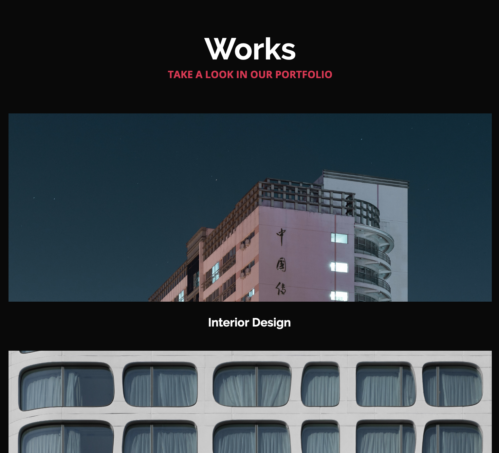

# Requirements


> - A README.md file at the root of the folder of the project is mandatory
> - Allowed editors: vi, vim, emacs
> - HTML and CSS have been rendered on Chrome 78 or more.

### Wireframe of the Techium project - mobile version


### Starter files

#### 00-index.html

```sh
<!DOCTYPE html>
<html lang="en" dir="ltr">
  <head>
    <meta charset="utf-8">
    <meta name="viewport" content="width=device-width, initial-scale=1, viewport-fit=cover">
    <title>Homepage - Techium</title>
    <meta name="description" content="Description of the page less than 150 characters">
    <link rel="icon" type="image/png" href="images/favicon.jpg">
    <link href="https://fonts.googleapis.com/css?family=Open+Sans:400,700|Raleway:700&display=swap" rel="stylesheet">
    <link rel='stylesheet' href='00-styles.css'>
  </head>
  <body>
    <!– Header –>
    <header class="header" data-section-theme="dark">
      <div class="container">
            <div class="header-container">
        <div class="header-logo">
          <a href="#">
            
          </a>
        </div>
        <nav class="navbar-menu">
          <ul class="nav">
            <li class="nav-item">
              <a href="#" class="nav-link">Home</a>
            </li>
            <li class="nav-item">
              <a href="#services" class="nav-link">Services</a>
            </li>
            <li class="nav-item">
              <a href="#works" class="nav-link">Works</a>
            </li>
            <li class="nav-item">
              <a href="#about" class="nav-link">About</a>
            </li>
            <li class="nav-item">
              <a href="#latest_news" class="nav-link">Latest news</a>
            </li>
            <li class="nav-item">
              <a href="#testimonials" class="nav-link">Testimonials</a>
            </li>
            <li class="nav-item">
              <a href="#contact" class="nav-link">Contact</a>
            </li>
                        <li class="nav-item">
                <form action="#" method="post" class="form-search">
                  <input type="search" name="q" id="search-input" placeholder="Search..." aria-label="Search through site content">
                  <button class="search-button">
                    <svg viewBox="0 0 512 512" xmlns="http://www.w3.org/2000/svg" width="20" height="20" class="search-icon">
                      <title>
                        Search icon
                      </title>
                      <path d="M508.5 468.9L387.1 347.5c-2.3-2.3-5.3-3.5-8.5-3.5h-13.2c31.5-36.5 50.6-84 50.6-136C416 93.1 322.9 0 208 0S0 93.1 0 208s93.1 208 208 208c52 0 99.5-19.1 136-50.6v13.2c0 3.2 1.3 6.2 3.5 8.5l121.4 121.4c4.7 4.7 12.3 4.7 17 0l22.6-22.6c4.7-4.7 4.7-12.3 0-17zM208 368c-88.4 0-160-71.6-160-160S119.6 48 208 48s160 71.6 160 160-71.6 160-160 160z"></path>
                    </svg>
                  </button>
                </form>
              </li>
          </ul>
        </nav>
      </div>
            </div>
    </header>
    <!– Main –>
    <main>
      <!– Hero section –>
      <section class="section-hero hero-homepage" data-section-theme="dark">
        <div class="container">
          <div class="section-body">
            <section class="section-inner">
              <h2 class="section-title">We help you build your brand</h2>
              <a href="#" class="button">Get Started</a>
            </section>
          </div>
        </div>
      </section>
      <!– Services section –>
      <section id="services" class="section section-services">
        <div class="container">
          <header class="section-header">
            <h2 class="section-title">Services</h2>
            <p class="section-tagline">We work with you</p>
          </header>
          <div class="section-body">
            <ul class="row">
              <li class="col-1-3">
                <div class="card-services">
                  <h3 class="card-title"><a href="#">Design & Concept</a></h3>
                </div>
              </li>
              <li class="col-1-3">
                <div class="card-services">
                  <h3 class="card-title"><a href="#">Digital Strategy</a></h3>
                </div>
              </li>
              <li class="col-1-3">
                <div class="card-services">
                  <h3 class="card-title"><a href="#">Content Strategy</a></h3>
                </div>
              </li>
            </ul>
            <ul class="row">
              <li class="col-1-3">
                <div class="card-services">
                  <h3 class="card-title"><a href="#">UX Design</a></h3>
                </div>
              </li>
              <li class="col-1-3">
                <div class="card-services">
                  <h3 class="card-title"><a href="#">Web Development</a></h3>
                </div>
              </li>
              <li class="col-1-3">
                <div class="card-services">
                  <h3 class="card-title"><a href="#">Social Media</a></h3>
                </div>
              </li>
            </ul>
          </div>
        </div>
      </section>
      <!– Works section –>
      <section id="works" class="section section-works" data-section-theme="dark">
        <div class="container">
          <header class="section-header">
            <h2 class="section-title">Works</h2>
            <p class="section-tagline">Take a look at our portfolio</p>
          </header>
          <div class="section-body">
            <ul class="row">
              <li class="col-1-3">
                <article class="card-work">
                  <div class="card-outer">
                    <div class="card-image">
                      
                    </div>
                    <div class="card-inner">
                      <h3 class="card-title"><a href="#">Interior Design</a></h3>
                    </div>
                  </div>
                </article>
              </li>
              <li class="col-1-3">
                <article class="card-work">
                  <div class="card-outer">
                    <div class="card-image">
                      
                    </div>
                    <div class="card-inner">
                      <h3 class="card-title"><a href="#">Web Development</a></h3>
                    </div>
                  </div>
                </article>
              </li>
              <li class="col-1-3">
                <article class="card-work">
                  <div class="card-outer">
                    <div class="card-image">
                      
                    </div>
                    <div class="card-inner">
                      <h3 class="card-title"><a href="#">Personal Development</a></h3>
                    </div>
                  </div>
                </article>
              </li>
            </ul>
          </div>
        </div>
      </section>
      <!– About Us section –>
      <section id="about" class="section section-about-us">
        <div class="container">
          <header class="section-header">
            <h2 class="section-title">About Us</h2>
            <p class="section-tagline">Everything about us</p>
          </header>
          <div class="section-body">
            <div class="row">
              <div class="col-1-2">
                
              </div>
              <div class="col-1-2">
                <h3>Who are we</h3>
                <p>Lorem ipsum dolor sit amet, consectetur adipisicing elit. Ipsum, omnis expedita! Eum, praesentium cumque accusantium rem, sit quaerat est nisi ratione, deserunt ducimus quidem iste dicta quibusdam atque maxime cum!</p>
                <h3>Our culture</h3>
                <p>Lorem ipsum dolor sit amet, consectetur adipisicing elit. Ipsum, omnis expedita! Eum, praesentium cumque accusantium rem, sit quaerat est nisi ratione, deserunt ducimus quidem iste dicta quibusdam atque maxime cum!</p>
                <h3>How we work</h3>
                <p>Lorem ipsum dolor sit amet, consectetur adipisicing elit. Ipsum, omnis expedita! Eum, praesentium cumque accusantium rem, sit quaerat est nisi ratione, deserunt ducimus quidem iste dicta quibusdam atque maxime cum!</p>
              </div>
            </div>
          </div>
          <div class="section-footer">
            <a href="#" class="button">Learn more about us</a>
          </div>
        </div>
      </section>
      <!– Latest news section –>
      <section id="latest_news" class="section section-latest-news">
        <div class="container">
          <header class="section-header">
            <h2 class="section-title">Latest News</h2>
          </header>
          <div class="section-body">
            <ul class="row">
              <li class="col-1-3">
                <article class="card-blog">
                  <div>
                    
                  </div>
                  <p class="card-category">Career</p>
                  <h3><a href="#">Hoc loco tenere se Triarius non potuit.</a></h3>
                  <p>Lorem ipsum dolor sit amet, consectetur adipiscing elit. Id Sextilius factum negabat. Quo tandem modo? At eum nihili facit; Quae contraria sunt his, malane?</p>
                  <small>By Kelly D.</small>
                </article>
              </li>
              <li class="col-1-3">
                <article class="card-blog">
                  <div>
                    
                  </div>
                  <p class="card-category">Digital Life</p>
                  <h3><a href="#">Ut alios omittam, hunc appello, quem ille unum secutus est.</a></h3>
                  <p>Lorem ipsum dolor sit amet, consectetur adipiscing elit. Tum mihi Piso: Quid ergo? Tum ille: Ain tandem? Non autem hoc: igitur ne illud quidem. Sed quod proximum fuit non vidit. Nos commodius agimus. An nisi populari fama?</p>
                  <small>By William A.</small>
                </article>
              </li>
              <li class="col-1-3">
                <article class="card-blog">
                  <div>
                    
                  </div>
                  <p class="card-category">Social</p>
                  <h3><a href="#">Bestiarum vero nullum iudicium puto.</a></h3>
                  <p>Lorem ipsum dolor sit amet, consectetur adipiscing elit. Non igitur bene. Quid enim est a Chrysippo praetermissum in Stoicis? Pugnant Stoici cum Peripateticis. Prioris generis est docilitas, memoria; Apparet statim, quae sint officia, quae actiones.</p>
                  <small>By Frances J.</small>
                </article>
              </li>
            </ul>
          </div>
        </div>
      </section>
      <!– Testimonials section –>
      <section id="testimonial" class="section section-testimonial">
        <div class="container">
          <header class="section-header">
            <h2 class="section-title">Testimonials</h2>
            <p class="section-tagline">We are more than a digital company</p>
          </header>
          <div class="section-body">
            <ul class="row">
              <li class="col-1-3">
                <article class="card-testimonial">
                  
                  <blockquote class="card-quote">
                    <p>I am completely blown away. Thanks to Techium, we’ve just launched our 5th website!
                      <cite>Yuri Y.</cite>
                    </p>
                  </blockquote>
                </article>
              </li>
              <li class="col-1-3">
                <article class="card-testimonial">
                  
                  <blockquote class="card-quote">
                    <p>Thank you so much for your help. Techium company is awesome!
                      <cite>Dorrie S.</cite>
                    </p>
                  </blockquote>
                </article>
              </li>
              <li class="col-1-3">
                <article class="card-testimonial">
                  
                  <blockquote class="card-quote">
                    <p>I love your system. Definitely worth the investment. I’d be lost without Techium company.
                      <cite>Sven H.</cite>
                    </p>
                  </blockquote>
                </article>
              </li>
            </ul>
          </div>
        </div>
      </section>
      <!– Contact section –>
      <section id="contact" class="section section-contact">
        <div class="container">
          <header class="section-header">
            <h2 class="section-title">Contact</h2>
            <p class="section-tagline">We’d love to hear from you!</p>
          </header>
          <div class="section-body">
            <p>Lorem ipsum dolor sit amet, consectetur adipiscing elit. Id Sextilius factum negabat. Quo tandem modo? At eum nihili facit; Quae contraria sunt his, malane?</p>
          </div>
          <div class="section-footer">
            <a href="#" class="button">Get in touch</a>
          </div>
        </div>
      </section>
    </main>
    <!– Footer –>
    <footer class="footer" data-section-theme="dark">
      <div  class="container">
        <div class="row">
          <div class="col-1-2">
            
            <address class="footer-address">
              972 Mission St<br>
              San Francisco, CA<br>
              94103
            </address>
          </div>
          <div class="col-1-2">
            <ul class="social nav">
              <li class="social-item nav-item">
                <a href="https://www.facebook.com/HolbertonSchool/" class="social-link">
                  <svg viewbox="0 0 24 24" xmlns="http://www.w3.org/2000/svg" width="25" height="25">
                    <title>
                      Facebook icon
                    </title>
                    <path d="M23.998 12c0-6.628-5.372-12-11.999-12C5.372 0 0 5.372 0 12c0 5.988 4.388 10.952 10.124 11.852v-8.384H7.078v-3.469h3.046V9.356c0-3.008 1.792-4.669 4.532-4.669 1.313 0 2.686.234 2.686.234v2.953H15.83c-1.49 0-1.955.925-1.955 1.874V12h3.328l-.532 3.469h-2.796v8.384c5.736-.9 10.124-5.864 10.124-11.853z"/>
                  </svg>
                </a>
              </li>
              <li class="social-item nav-item">
                <a href="https://twitter.com/holbertonschool" class="social-link">
                  <svg viewbox="0 0 24 24" xmlns="http://www.w3.org/2000/svg" width="25" height="25">
                    <title>
                      Twitter icon
                    </title>
                    <path d="M23.954 4.569a10 10 0 0 1-2.825.775 4.958 4.958 0 0 0 2.163-2.723c-.951.555-2.005.959-3.127 1.184a4.92 4.92 0 0 0-8.384 4.482C7.691 8.094 4.066 6.13 1.64 3.161a4.822 4.822 0 0 0-.666 2.475c0 1.71.87 3.213 2.188 4.096a4.904 4.904 0 0 1-2.228-.616v.061a4.923 4.923 0 0 0 3.946 4.827 4.996 4.996 0 0 1-2.212.085 4.937 4.937 0 0 0 4.604 3.417 9.868 9.868 0 0 1-6.102 2.105c-.39 0-.779-.023-1.17-.067a13.995 13.995 0 0 0 7.557 2.209c9.054 0 13.999-7.496 13.999-13.986 0-.209 0-.42-.015-.63a9.936 9.936 0 0 0 2.46-2.548l-.047-.02z"/>
                  </svg>
                </a>
              </li>
              <li class="social-item nav-item">
                <a href="https://www.instagram.com/holbertonschool/" class="social-link">
                  <svg viewbox="0 0 24 24" xmlns="http://www.w3.org/2000/svg" width="25" height="25">
                    <title>
                      Instagram icon
                    </title>
                    <path d="M12 0C8.74 0 8.333.015 7.053.072 5.775.132 4.905.333 4.14.63c-.789.306-1.459.717-2.126 1.384S.935 3.35.63 4.14C.333 4.905.131 5.775.072 7.053.012 8.333 0 8.74 0 12s.015 3.667.072 4.947c.06 1.277.261 2.148.558 2.913a5.885 5.885 0 0 0 1.384 2.126A5.868 5.868 0 0 0 4.14 23.37c.766.296 1.636.499 2.913.558C8.333 23.988 8.74 24 12 24s3.667-.015 4.947-.072c1.277-.06 2.148-.262 2.913-.558a5.898 5.898 0 0 0 2.126-1.384 5.86 5.86 0 0 0 1.384-2.126c.296-.765.499-1.636.558-2.913.06-1.28.072-1.687.072-4.947s-.015-3.667-.072-4.947c-.06-1.277-.262-2.149-.558-2.913a5.89 5.89 0 0 0-1.384-2.126A5.847 5.847 0 0 0 19.86.63c-.765-.297-1.636-.499-2.913-.558C15.667.012 15.26 0 12 0zm0 2.16c3.203 0 3.585.016 4.85.071 1.17.055 1.805.249 2.227.415.562.217.96.477 1.382.896.419.42.679.819.896 1.381.164.422.36 1.057.413 2.227.057 1.266.07 1.646.07 4.85s-.015 3.585-.074 4.85c-.061 1.17-.256 1.805-.421 2.227a3.81 3.81 0 0 1-.899 1.382 3.744 3.744 0 0 1-1.38.896c-.42.164-1.065.36-2.235.413-1.274.057-1.649.07-4.859.07-3.211 0-3.586-.015-4.859-.074-1.171-.061-1.816-.256-2.236-.421a3.716 3.716 0 0 1-1.379-.899 3.644 3.644 0 0 1-.9-1.38c-.165-.42-.359-1.065-.42-2.235-.045-1.26-.061-1.649-.061-4.844 0-3.196.016-3.586.061-4.861.061-1.17.255-1.814.42-2.234.21-.57.479-.96.9-1.381.419-.419.81-.689 1.379-.898.42-.166 1.051-.361 2.221-.421 1.275-.045 1.65-.06 4.859-.06l.045.03zm0 3.678a6.162 6.162 0 1 0 0 12.324 6.162 6.162 0 1 0 0-12.324zM12 16c-2.21 0-4-1.79-4-4s1.79-4 4-4 4 1.79 4 4-1.79 4-4 4zm7.846-10.405a1.441 1.441 0 0 1-2.88 0 1.44 1.44 0 0 1 2.88 0z"/>
                  </svg>
                </a>
              </li>
            </ul>
          </div>
        </div>
        <hr>
        <div class="row">
          <div class="col-1-2">
            <p class="footer-copyright">© 2020 Techium, made with ♥ by students at Holberton School.</p>
          </div>
          <div class="col-1-2">
            <ul class="footer-nav nav">
              <li class="footer-nav-item nav-item">
                <a href="#" class="footer-nav-link">Terms of use</a>
              </li>
              <li class="footer-nav-item nav-item">
                <a href="#" class="footer-nav-link">Privacy Policy</a>
              </li>
              <li class="footer-nav-item nav-item">
                <a href="#" class="footer-nav-link">Cookie Policy</a>
              </li>
            </ul>
          </div>
        </div>
      </div>
    </footer>
  </body>
</html>

```

#### 00-styles.css

```sh
/* SUMMARY
1. GLOBAL
2. LAYOUT
3. SECTION
4. CARD
*/


/*** 1. GLOBAL ***/

/* Reset / Normalize
  ============================= */

/*! normalize.css v8.0.1 | MIT License | github.com/necolas/normalize.css */html{line-height:1.15;-webkit-text-size-adjust:100%}body{margin:0}main{display:block}h1{font-size:2em;margin:.67em 0}hr{box-sizing:content-box;height:0;overflow:visible}pre{font-family:monospace,monospace;font-size:1em}a{background-color:transparent}abbr[title]{border-bottom:none;text-decoration:underline;text-decoration:underline dotted}b,strong{font-weight:bolder}code,kbd,samp{font-family:monospace,monospace;font-size:1em}small{font-size:80%}sub,sup{font-size:75%;line-height:0;position:relative;vertical-align:baseline}sub{bottom:-.25em}sup{top:-.5em}img{border-style:none}button,input,optgroup,select,textarea{font-family:inherit;font-size:100%;line-height:1.15;margin:0}button,input{overflow:visible}button,select{text-transform:none}[type=button],[type=reset],[type=submit],button{-webkit-appearance:button}[type=button]::-moz-focus-inner,[type=reset]::-moz-focus-inner,[type=submit]::-moz-focus-inner,button::-moz-focus-inner{border-style:none;padding:0}[type=button]:-moz-focusring,[type=reset]:-moz-focusring,[type=submit]:-moz-focusring,button:-moz-focusring{outline:1px dotted ButtonText}fieldset{padding:.35em .75em .625em}legend{box-sizing:border-box;color:inherit;display:table;max-width:100%;padding:0;white-space:normal}progress{vertical-align:baseline}textarea{overflow:auto}[type=checkbox],[type=radio]{box-sizing:border-box;padding:0}[type=number]::-webkit-inner-spin-button,[type=number]::-webkit-outer-spin-button{height:auto}[type=search]{-webkit-appearance:textfield;outline-offset:-2px}[type=search]::-webkit-search-decoration{-webkit-appearance:none}::-webkit-file-upload-button{-webkit-appearance:button;font:inherit}details{display:block}summary{display:list-item}template{display:none}[hidden]{display:none}

/* Variables
  ============================= */

  :root {
    --color-primary: #D73953;
    --color-black:  #090909;
    --color-white: #ffffff;
    --color-grey: #a0a0a0;
    --color-light-grey: #f3f3f3;
    --color-dark-grey: #353535;
    --color-red: #cd3e65;
    --color-green: #08805b;
  
    --text-color: var(--color-black);
    --valid-color: var(--color-green);
    --error-color: var(--color-red);
  
    --font-family-base: 'Open Sans', 'Helvetica Neue', Helvetica, Arial, sans-serif;
    --font-family-title: 'Raleway', 'Helvetica Neue', Helvetica, Arial, sans-serif;
  
    --font-size-small: 1.2rem;
    --font-size-medium: 1.6rem;
    --font-size-large: 1.8rem;
    --font-size-x-large: 2.3rem;
    --font-size-xx-large: 4.8rem;
  
    --font-weight-regular: 400;
    --font-weight-bold: 700;
  
    --line-height-small: 1.2;
    --line-height-base: 1.5;
    --line-height-big: 1.8;
  
    /** SECTION **/
    --section-padding: 5rem 0;
    --section-header-padding: 0 0 3rem;
    --section-header-align: center;
    --section-title-font-size: var(--font-size-xx-large);
    --section-title-font-weight: var(--font-weight-bold);
    --section-title-line-height: var(--line-height-small);
    --section-title-margin: 0;
    --section-title-color: var(--color-black);
    --section-tagline-transform: uppercase;
    --section-tagline-color: var(--color-primary);
    --section-tagline-font-family: var(--font-family-headings);
    --section-tagline-font-weight: var(--font-weight-bold);
    --section-tagline-margin: 0;
    --section-body-padding: 2rem 0 4rem;
    --section-footer-padding: 3rem 0 0;
    --section-footer-align: center;
  
    /** HEADER **/
    --header-padding: 4rem 0 0;
  
    /** FOOTER **/
    --footer-padding: 5rem 0 1rem;
  
    /** NAVBAR **/
    --nav-item-font-family: var(--font-family-headings);
    --nav-item-font-weight: var(--font-weight-bold);
    --nav-item-font-size: var(--font-size-medium);
    --nav-item-letter-spacing: .04rem;
    --nav-item-display: inline-block;
    --nav-item-margin: 0 0 0 2rem;
    --nav-item-link-hover: var(--color-white);
  
    /** BUTTON **/
    --button-display: inline-block;
    --button-padding: 1.5rem 3rem;
    --button-border: var(--color-primary) solid 0.2rem;
    --button-color: var(--color-black);
    --button-text-decoration: none;
    --button-font-size: var(--font-size-large);
    --button-hover-color: var(--color-white);
    --button-hover-text-decoration: none;
    --button-hover-background: var(--color-primary);
  
    /** MOTION **/
    --transition-duration: .3s;
    --transition-cubic-bezier: cubic-bezier(0.17, 0.67, 0, 1.01);
  }
  
  /* Base
      ============================= */
  
  *, *:before, *:after {
    box-sizing: border-box;
  }
  
  html {
  scroll-behavior: smooth;
  font-size: 62.5%;
  }
  
  body {
    color: var(--text-color);
    font-family: var(--font-family-base);
    font-size: var(--font-size-medium);
    font-weight: var(--font-weight-regular);
    line-height: var(--line-height-base);
  }
  
  h1, h2, h3, h4, h5, h6 {
    font-family: var(--font-family-title);
    font-weight: var(--font-weight-bold);
  }
  
  a {
    color: var(--text-color);
    text-decoration: none;
  }
  
  a:visited {
    font-style: italic;
  }
  
  a:hover {
    text-decoration: underline;
  }
  
  a:active {
    background-color: var(--color-light-grey);
  }
  
  .button {
    display: var(--button-display);
    padding: var(--button-padding);
    border: var(--button-border);
    font-size: var(--button-font-size);
    color: var(--button-color);
    text-decoration: var(--button-text-decoration);
    cursor: pointer;
  }
  
  .button:hover {
    color: var(--button-hover-color);
    text-decoration: var(--button-hover-text-decoration);
    background: var(--button-hover-background);
    transition-duration: var(--transition-duration);
    transition-property: color, background-color;
  }
  
  .button-primary {
    color: var(--color-white);
    background: var(--color-primary);
  }
  
  .button-primary:hover {
    color: var(--color-primary);
    background: var(--color-white);
  }
  
  /* Helpers
      ============================= */
  
  .visually-hidden:not(:focus):not(:active) {
    position: absolute !important;
    height: 1px;
    width: 1px;
    overflow: hidden;
    clip: rect(1px, 1px, 1px, 1px);
    white-space: nowrap;
  }
  
  /*** 2. LAYOUT ***/
  
  /* Layout
      ============================= */
  
  .container {
    width: 960px;
    margin-left: auto;
    margin-right: auto;
  }
  
  /* Grid
      ============================= */
  
  ul.row {
    margin: -1rem;
    padding: 0;
    list-style: none;
  }
  
  .row {
    display: flex;
  }
  
  [class*='col-'] {
    margin: 1rem;
  }
  
  .col-1-3 {
    width: calc((100% / 3) - 2rem);
  }
  
  .col-1-2 {
    width: calc((100% / 2) - 2rem);
  }
  
  /* Navbar
      ============================= */
  
  .nav {
    margin: 0;
    padding: 0;
    list-style: none;
    text-align: center;
    display: flex;
  }
  
  .nav .nav-item {
    font-family: var(--nav-item-font-family);
    font-weight: var(--nav-item-font-weight);
    font-size: var(--nav-item-font-size);
    letter-spacing: var(--nav-item-letter-spacing);
  }
  
  .nav .nav-item + .nav-item {
    margin: var(--nav-item-margin);
  }
  
  .nav .nav-link {
    display: block;
    padding: 0.5rem 0;
    position: relative;
  }
  
  .nav .nav-link:hover {
    color: var(--nav-item-link-hover);
    text-decoration: none;
  }
  
  .nav .nav-link::before {
    content: '';
    position: absolute;
    bottom: 0;
    left: 0;
    background-color: var(--color-white);
    width: 0;
    height: 0.2rem;
    transition: var(--transition-duration) var(--transition-cubic-bezier);
  }
  
  .nav .nav-item:hover .nav-link::before {
    background-color: var(--color-primary);
    width: 100%;
  }
  
  /* Header
      ============================= */
  
  .header {
    padding: var(--header-padding);
    position: relative;
    z-index: 3;
    background: transparent;
  }
  
  .header-container {
    display: flex;
    justify-content: space-between;
    align-items: center;
  }
  
  /* Footer
      ============================= */
  
  .footer {
    --nav-item-font-weight: normal;
    --nav-item-font-size: var(--font-size-small);
    padding: var(--footer-padding);
  }
  
  .footer-copyright {
    margin: 0;
    font-size: var(--font-size-small);
    color: var(--text-color);
  }
  
  .footer ul {
    text-align: right;
  }
  
  .footer-address {
    color: var(--text-color);
  }
  
  .social-link {
    display: block;
  }
  
  .social-link > svg {
    fill: var(--text-color);
  }
  
  /*** 3. SECTION ***/
  
  /* Section (all styles)
      ============================= */
  
  .section {
    padding: var(--section-padding);
  }
  
  .section-header {
    text-align: var(--section-header-align);
    padding: var(--section-header-padding);
  }
  
  .section-title {
    font-size: var(--section-title-font-size);
    font-weight: var(--section-title-font-weight);
    line-height: var(--section-title-line-height);
    margin: var(--section-title-margin);
    color: var(--section-title-color);
  }
  
  .section-tagline {
    color: var(--section-tagline-color);
    font-family: var(--section-tagline-font-family);
    text-transform: var(--section-tagline-transform);
    font-weight: var(--section-tagline-font-weight);
    margin: var(--section-tagline-margin);
  }
  
  .section-body {
    padding: var(--section-body-padding);
  }
  
  .section-footer {
    padding: var(--section-footer-padding);
    text-align: var(--section-footer-align);
  }
  
  /* Section theming
      ============================= */
  
  [data-section-theme="dark"] {
    --button-color: var(--color-white);
    --text-color: var(--color-white);
    --section-title-color: var(--color-white);
    background: var(--color-black);
  }
  
  /* Section HERO
      ============================= */
  
  .section-hero {
    position: relative;
    margin-top: -8.5rem;
  }
  
  .hero-homepage {
    background-image: url(images/banner-home.jpg);
    background-position: 75% 0;
    background-repeat: no-repeat;
    background-size: 90rem auto;
  }
  
  .section-hero .section-body {
    padding: 10rem 4rem;
  }
  
  .section-hero .section-category {
    color: var(--color-white);
    text-transform: uppercase;
  }
  
  .section-hero .section-title {
    margin-bottom: 5rem;
  }
  
  .section-hero .section-inner {
    display: flex;
    flex-direction: column;
    align-items: flex-start;
    justify-content: center;
    min-height: 50vh;
  }
  /* Section Latest news
      ============================= */
  
  .section-latest-news .row {
    flex-direction: row-reverse;
  }
  
  /* Section SERVICES
      ============================= */
  
  .section-services .row {
    flex-wrap: wrap;
  }
  
  /* Section ABOUT US
      ============================= */
  
  .section-about-us [class*='col-'] {
    align-self: center;
  }
  
  /*** 4. CARD ***/
  
  /* Card (all styles)
      ============================= */
  
  .card-category {
    color: var(--color-primary);
  }
  
  /* Card WORK
      ============================= */
  
  .card-work .card-outer {
    position: relative;
    overflow: hidden;
  }
  
  .card-work:hover .card-outer {
    transform: scale(0.95);
  }
  
  .card-work .card-image img {
    height: 30rem;
    width: 100%;
    object-fit: cover;
    vertical-align: bottom;
  }
  
  .card-work:hover .card-image {
    transform: scale(1.2);
    transition: var(--transition-duration) var(--transition-cubic-bezier);
  }
  
  .card-work .card-inner {
    position: absolute;
    top: -0.1rem;
    left: -0.1rem;
    right: -0.1rem;
    bottom: -0.1rem;
    z-index: 1;
    transition: var(--transition-duration) var(--transition-cubic-bezier);
  }
  
  .card-work:hover .card-inner {
    background-color: rgba(0, 0, 0, 0.7);
  }
  
  .card-work .card-title {
    text-align: center;
    margin: 0;
    opacity: 0;
    height: 100%;
    position: relative;
  }
  
  .card-work .card-title a {
    display: block;
    text-decoration: none;
    padding-top: 45%;
  }
  
  .card-work .card-title a::after {
    position: absolute;
    top: 0;
    left: 0;
    right: 0;
    bottom: 0;
    content: '';
  }
  
  .card-work:hover .card-title {
    opacity: 1;
  }
  
  /* Card SERVICES
      ============================= */
  
  .card-services .card-title {
    margin: 0;
  }
  
  .card-services a {
    display: block;
    padding: 2rem;
    background-color: var(--color-light-grey);
  }
  
  .card-services a:hover {
    color: var(--color-white);
    background: var(--color-primary);
    text-decoration: none;
    transition-duration: 0.3s;
    transition-property: color, background-color;
  }
  
  /* Card TESTIMONIAL
      ============================= */
  
  .card-testimonial {
    text-align: center;
  }
  
  .card-testimonial .card-avatar {
    border-radius: 50%;
    width: 10rem;
    height: 10rem;
  }
  
  .card-testimonial .card-quote cite {
    display: block;
    padding-top: 1rem;
    color: var(--color-primary);
  }
  
  .card-testimonial .card-quote {
    position: relative;
  }
  
  .card-testimonial .card-quote::before {
    content: '\201C';
    position: absolute;
    top: -4.5rem;
    left: -1rem;
    color: #efeded;
    font-size: 10rem;
    z-index: -1;
  }
  
  /*** ARTICLE PAGE ***/
  
  /* Section HERO (article)
      ============================= */
  
  .hero-article {
    background-size: 150rem 100rem;
    background-position: 50% 0;
  }
  
  .hero-article::before {
    content: '';
    background: rgba(0, 0, 0, 0.8);
    position: absolute;
    top: 0;
    right: 0;
    left: 0;
    bottom: 0;
    z-index: 0;
  }
  
  .hero-article .section-inner {
    text-align: center;
    align-items: center;
    min-height: 40vh;
  }
  
  .hero-article .section-body {
    position: relative;
    padding: 7rem 0 0;
    z-index: 2;
  }
  
  .main-article {
    padding: 5rem 0;
  }
  
  /* Post
      ============================= */
  
  .post {
    display: flex;
    align-items: baseline;
  }
  
  .post-content {
    width: 100%;
    padding-left: 7rem;
  }
  
  .post-aside {
    order: -1;
    min-width: 20%;
  }
  
  .post img {
    width: 100%;
    height: auto;
  }
  
  .post-content p:first-child {
    font-size: var(--font-size-x-large);
  }
  
  .post-content .img-caption {
    margin: 1rem 0;
    padding: 0 0.5rem;
    font-size: var(--font-size-small);
    color: var(--color-grey);
    text-align: center;
  }
  
  /* Post Meta
      ============================= */
  
  .post-meta-list {
    flex-direction: column;
  }
  
  .post-meta-list strong {
    color: var(--color-primary);
    font-size: 1.3rem;
    font-weight: var(--font-weight-bold);
    text-transform: uppercase;
    letter-spacing: normal;
    display: block;
  }
  
  .post-meta-list [class*='post-meta'] {
    margin-bottom: 1rem;
    padding-bottom: 1rem;
    border-bottom: 0.2rem solid var(--color-light-grey);
  }
  
  .post-meta-list [class*='post-meta']:last-child {
    border: none;
    margin-bottom: 3rem;
  }
  
  /* Tag list
      ============================= */
  
  .tag-list {
    padding: 0;
    list-style: none;
  }
  
  .tag-list li {
    display: inline;
  }
  
  .tag-list li::after {
    content: ", ";
  }
  
  .tag-list li:last-child::after {
    content: "";
  }
  
  /*** FORM ***/
  
  /* Comment section
      ============================= */
  
  .post-comments {
    width: 80%;
    margin: 10rem 0 0 auto;
    padding-left: 7rem;
  }
  
  .post-comments .section-title {
    font-variant: small-caps;
  }
  
  /* Basic form
      ============================= */
  
  form {
    display: flex;
    flex-direction: column;
    padding: 1rem 0;
    margin: 0;
  }
  
  fieldset {
    border: 0;
    display: flex;
    flex-direction: column;
    justify-content: flex-start;
    padding: 0 0 2rem;
  }
  
  label {
    cursor: pointer;
    display: block;
    white-space: nowrap;
    font-size: 1.4rem;
    padding: 0 0 .5rem;
  }
  
  input[type=text],
  input[type=email],
  textarea {
    position: relative;
    width: 100%;
    padding: 1.2rem;
    line-height: 1;
    border: .1rem solid var(--color-black);
    background-color: var(--color-white);
    box-shadow: none;
    outline: 0;
  }
  
  input[type=text],
  input[type=email] {
    padding-right: 3rem;
  }
  
  input[type=text]:focus,
  input[type=email]:focus,
  textarea:focus {
    border: .1rem solid var(--color-grey);
  }
  
  ::placeholder {
    font-style: italic;
    font-size: var(--font-size-small);
  }
  
  /* Form group
      ============================= */
  
  .form-group {
    padding: 1rem;
    margin: 0;
    background-color: var(--color-white);
  }
  
  .form-group:focus-within {
    background-color: var(--color-light-grey);
    transition: .3s;
  }
  
  /* Form field
      ============================= */
  
  .form-field-container {
    position: relative;
  }
  
  .form-field-icon {
    font-style: normal;
  }
  
  /* Form help
      ============================= */
  
  .form-group .form-help {
    margin: 0;
    line-height: 1.3;
    letter-spacing: .019rem;
    color: var(--color-dark-grey);
    font-size: var(--font-size-small);
    max-height: 0;
    transition: .3s;
    overflow: hidden;
  }
  
  .form-group:focus-within .form-help {
    max-height: 20rem;
    margin: .4rem 0 0;
  }
  
  /* Form error handling
      ============================= */
  
  input:not(:placeholder-shown) ~ .form-field-icon::after {
    height: 100%;
    right: 0;
    pointer-events: none;
    position: absolute;
    top: 0;
    width: 1.3em;
  }
  
  input:required:invalid:not(:focus):not(:placeholder-shown) ~ .form-field-icon::after {
    content: '✘';
    color: var(--error-color);
  }
  
  input:required:valid ~ .form-field-icon::after {
    content: '✔';
    color: var(--valid-color);
  }
  
  input:required:valid ~ .form-help {
    max-height: 0;
  }
  
  input:required:invalid:not(:focus):not(:placeholder-shown),
  textarea:invalid:not(:focus):not(:placeholder-shown) {
    border: 0.1rem solid var(--error-color);
  }
  
  input:required:valid:not(:placeholder-shown),
  textarea:valid:not(:placeholder-shown) {
    border: 0.1rem solid var(--valid-color);
  }
  
  /*** SEARCH FORM ***/
  
  .form-search {
    display: block;
    padding: .5rem 0;
    position: relative;
  }
  
  .form-search .search-button {
    display: inline-block;
    background: transparent;
    border: 0;
    margin: 0;
    padding: 0;
  }
  
  .search-button .search-icon {
    fill: var(--color-white);
    width: 1.5rem;
    height: 1.5rem;
  }
  
  .form-search input[type="search"] {
    display: inline-block;
    color: var(--color-white);
    padding-right: 2rem;
    height: 3rem;
    border: 0;
    outline: none;
    position: absolute;
    width: 0;
    right: 0;
    background: none;
    cursor: pointer;
    z-index: 3;
    transition: width .4s cubic-bezier(0, 0.795, 0, 1);
  }
  
  .form-search input[type="search"]:focus {
    position: relative;
    width: 15rem;
    z-index: 1;
    border-bottom: .1rem solid var(--color-grey);
    padding: 0;
    cursor: text;
    margin: 0 1rem;
  }

```

#### Images

Use the images that you downloaded in the CSS Advanced project and place them into an images directory at the root of the project.

Or some basics assets from this archive.zip

# Tasks

**0. Fix the hero banner**

File: [01-index.html](01-index.html/)  -  [01-styles.css](01-styles.css/)

Because we did some changes with the article.html page in the previous project, our hero banner background is no more visible. Let’s fix it!

But before that, to ensure we start on the same foot, you should use the starter HTML and CSS provided in the project description.

In your 01-styles.css file

- Inside the hero-homepage class selector, update some values:
> - Property: background-position, Value: 65% 8rem
> - Property: background-size, Value: 90rem auto
- Inside the selector that targets section-inner class inside section-hero class
> - Update the min-height to 35vh

Final rendering of the Hero section should look something like this


**1. Make the container flexible**

File: [02-index.html](02-index.html/)  -  [02-styles.css](02-styles.css/)

Using the previous file as the base, in your 02-styles.css file update the .container selector by changing width to max-width

If you resize your browser, you should see that the content is resizing.

Wide screen:


Narrow screen:


**2. Fix layout issues**

File: [02-1-index.html](02-1-index.html/)  -  [02-1-styles.css](02-1-styles.css/)

Whatever the browser you use, it’s a good idea from now on, to toggle the device view.

In a normal situation, you should start with “mobile first” in mind and write your CSS first for the mobile. But because we already have a desktop version, we will exceptionally add some media-queries for mobile and tablet.

- For extra large devices (no media queries)
- For desktop / large devices (max-width: 992px)
- For tablet / medium styles (max-width: 767px)
- For mobile styles (max-width: 480px)

We will put media queries at the end of each section to facilitate the reading but for performance reasons, the best practice is to unifiy all similar breakpoints at the end of the CSS file.

In your 02-1-styles.css file:

- inside the /* Helpers section target all images inside the main section
> - Property: width, Value: 100%
> - Property: height, Value: auto

- inside the /* Section Latest news section, add a new media query (max-width: 767px)
> - Target the row inside section-latest-news
> > - Property: flex-direction, Value: column

- inside the /* Grid section, at the end, add a new media query (max-width: 767px)
> - First, redefine the variable section-padding and give that value: 5rem 1.5rem. And redefine the variable section-body-padding with 2rem 0 0
> - Target the ul.row and the row class
> > - Property: flex-direction, Value: column
> > - Property: margin, Value: 0
> - Target all the classes that started with col-
> > - Property: margin, Value: 0 0 3rem 0
> - Target the col-1-3 and col-1-2 classes
> > - Property: width, Value: 100%

The navbar is not allowing the website to fit the window. We will temporarily hide it and create a mobile navbar later.

- inside the /* Navbar section, at the end, add a new media query (max-width: 767px)
> - Target the navbar-menu class
> > - Property: display, Value: none

You should now be able to easily view the website on a device of any screen/window size. I guess you are surprised that was so easy?!

Rendering on wide screen


Rendering on screen with max-width: 767px


Rendering on screen with max-width: 767px, you can see the navbar is hidden


**3. Generate images with responsive breakpoints**

File: [03-index.html](03-index.html/)  -  [03-styles.css](03-styles.css/)

Go to [Responsive Breakpoints](https://www.responsivebreakpoints.com/)

In Breakpoints generation settings:

- Resolution: From 380 to 1200
- Size step: 25
- Maximum images: 3
- Art-direction: Desktops
- Upload your images one at a time:
> - pic-about-01.jpg
> - pic-article-01.jpg
> - pic-article-02.jpg
> - pic-article-03.jpg
- Copy the markup for the  tags and replace your current  tags with it.
- Download the images and place them into the images directory

Here’s an example on how to add different resolutions of the same image

```sh

```

**4. Create the mobile icon and hide the menu**

File: [04-index.html](04-index.html/)  -  [04-styles.css](04-styles.css/)

We want to have a clickable icon that shows and hide our navigation. We don’t want to use JavaScript but find a pure HTML / CSS way. We learned that input type checkbox have a checked - unchecked state. So we are going to use this for our menu.

Using the previous files as the base for this project

Changes to the HTML

Just before the <nav class="navbar-menu">
- Create an input (which will be not visible)
> - Class: menu-btn
> - Type: checkbox
> - Id: menu-btn
- Create a label

- Class: menu-icon
> - For: menu-btn
> - In the label create an empty span with the navicon class.

Changes to the CSS

Inside the /* Navbar section, and inside the 767px media query

- Create the root global selector. We want to override a CSS variable:
> - Variable name: nav-item-margin, Value: 0
- In the selector for the navbar-menu class
> - Property: flex, Value: 1
- Target the nav class in header class
> - Property: flex-direction, Value: column (for the element of the menu be below each other)
> - Property: overflow, Value: hidden
> - Property: max-height, Value: 0 (the display property can’t be animated, so we use the height that can be animated)
> - Property: transition, Value: max-height .2s ease-out

Rendering on screen with max-width: 767px, the check box is the input


**5. Hamburger!**

File: [05-index.html](05-index.html/)  -  [05-styles.css](05-styles.css/)

Let’s now, use a little bit of CSS magic to create an “hamburger” icon just with CSS.

Using the previous files as the base for this task:

- Target the menu-icon class inside the header class
> - Property: cursor, Value: pointer
> - Property: padding, Value: 2.5rem
> - Property: position, Value: relative
> - Property: user-select, Value: none
- Target the navicon class inside themenu-icon class which is inside the header class
> - Property: background, Value: point to the color-white variable
> - Property: display, Value: block
> - Property: width, Value: 2rem
> - Property: height, Value: .2rem
> - Property: position, Value: relative
> - Property: transition, Value: background .2s ease-out
- Target the before and after pseudo elements of the navicon class inside the menu-icon class which is inside the header class
> - Property: content, Value: empty string
> - Property: display, Value: block
> - Property: width, Value: 100%
> - Property: height, Value: 100%
> - Property: position, Value: absolute
> - Property: background, Value: point to the color-white variable
> - Property: transition, Value: all .2s ease-out
- Target only the before pseudo element of the navicon class inside the menu-icon class which is inside the header class
> - Property: top, Value: .7rem
- Target only the after pseudo element of the navicon class inside the menu-icon class which is inside the header class
> - Property: top, Value: -.7rem

Rendering of the hamburger on max-width: 767px


**6. Add the behavior based on menu-btn state**

File: [06-index.html](06-index.html/)  -  [06-styles.css](06-styles.css/)

in your CSS file:

- Create a new comment section /* menu btn */
- Target menu-btn class inside header class
> - Property: display, Value: none
- Target navbar-menu class when the menu-btn class element is checked
> - Property: display, Value: block
- Target nav class inside navbar-menu class when the menu-btn class element is checked
> - Property: max-height, Value: 100%
> - Property: overflow, Value: inherit

- At the end of the /* Section HERO section, create a new media query for max-width: 767px
> - Target the section-hero class
> > - Property: margin, Value: -0.1rem 0
> - Target the hero-homepage class
> > - Property: background-position, Value: 85% 0
> - Target the section-body class inside section-hero class
> > - Property: padding, Value: 2rem

Look for the header class selector and remove the !important at the end of the background property.

Going back to the /* menu btn */ section

- Target the navicon class inside menu-icon class sibling to the menu-btn when it is checked and inside header class
> - Property: background, Value: transparent
- Target the before state of navicon class inside menu-icon class sibling to the menu-btn when it is checked and inside header class element
> - Property: transform, Value: rotate(-45deg)
- Target the after state of navicon class inside menu-icon class sibling to the menu-btn when it is checked and inside header class element
> - Property: transform, Value: rotate(45deg)
- Target the before and after states of navicon class when inside menu-icon class sibling to the menu-btn class when it is checked and inside header class
> - Property: top, Value: 0

- Create a new media query for max-width: 767px
> - Target the root and redefine the header-padding variable with 2rem 0 0
> - Target header class
> > - Property: background, Value: point to the color-black variable
> - Target the header-container class
> > - Property: flex-wrap, Value: wrap
> > - Property: padding, Value: 0 1.5rem
> - Target the menu-icon class inside the header class
> > - Property: display, Value: block

- Create a new media query for max-width: 480px
> - Target the header-logo class
> > - Property: flex-basis, Value: 70%

- Create a new media query with min-width: 481px and max-width: 767px
> - Target the header-logo class
> > - Property: flex-basis, Value: 79%

- Find the .header .menu-icon selector and add display: none; to hide the menu icon when we are on desktop mode.

Rendering on screen with max-width: 767px, when the input is unchecked the menu is not displayed


Rendering on screen with max-width: 767 px, when input is checked the menu block is displayed


Rendering on desktop screen, menu icon is not visible


**7. Make the font size responsive**

File: [07-index.html](07-index.html/)  -  [07-styles.css](07-styles.css/)

We have multiple ways to make the typography responsive. The basic way would be to create multiple media queries and set a different font-size. But because we are using REM that are based on 62.5% (defined in the html selector). Changing that value would change proportionally all font sizes.

In your CSS file at the end of the /* Base section

- Create a new media query for max-width: 480px
> - Target the html element
> > - Property: font-size, Value: 57%
- Create a new media query for min-width: 481px and max-width: 767px
> - Target the html element
> > - Property: font-size, Value 60%

This is a simple way to achieve responsive typography. More complex options can also be used to have a more granular control over the font sizes.

**8. Improve the "Works" section**

File: [08-index.html](08-index.html/)  -  [08-styles.css](08-styles.css/)

in 08-styles.css, at the end of the /* Card WORK

- Create a new media query of max-width: 767px
> - Target the card-inner class inside the card-work class
> > - Property: variable called text-color, Value: point to color-white variable
> > - Property: position, Value: relative
> - Target the card-title class inside the card-work class
> > - Property: opacity, Value: 1
> - Target all a tags inside .card-work .card-title class:
> > - Property: padding, Value: 2rem 1rem 0 1rem

Rendering on screen of max-width: 767px




**9. Improve the "Footer" section**

File: [09-index.html](09-index.html/)  -  [09-styles.css](09-styles.css/)

in 09-styles.css, in the /* Footer section

- Create a new media query of max-width: 767px.
> - Create the root global selector. We want to override a CSS variable:
> > - Variable name: footer-padding, Value: 5rem 2rem 1rem
> - Target .social.nav inside the footer class and the footer-nav class inside the footer class
> > - Property: text-align, Value: center
> - Target the adjacent lito the li inside the .social.nav and the adjacent li to the li inside .footer-nav (to easily add a left padding starting on the second li)
> > - Property: padding-left, Value:2rem

Rendering on screen of max-width: 767px


**10. Fix the top header background**

File: [10-index.html](10-index.html/)  -  [10-styles.css](10-styles.css/)

In 10-index.html, in the body tag, add the class article-page

In 10-styles.css, in the /* Section HERO section, just before the media query:

- Target section-hero class inside article-page class
> - Property: margin-top, Value: -8.5rem
> - Property: padding-top, Value: 5rem

Rendering of header and section-hero class elements


**11. Make the article page responsive**

File: [100-article.html](100-article.html/)  -  [100-styles.css](100-styles.css/)

use the following article.html for this task

```sh
<!DOCTYPE html>
<html lang="en" dir="ltr">
  <head>
    <meta charset="utf-8">
    <meta name="viewport" content="width=device-width, initial-scale=1, viewport-fit=cover">
    <title>Article - Techium</title>
    <meta name="description" content="Description of the page less than 150 characters">

    <link rel="icon" type="image/png" href="images/favicon.jpg">
    <link href="https://fonts.googleapis.com/css?family=Open+Sans:400,700|Raleway:700&display=swap" rel="stylesheet">
    <link rel="stylesheet" href="100-styles.css">
  </head>
  <body class="article-page">

    <!-- Header -->
    <header class="header" data-section-theme="dark">
      <div class="container">
        <div class="header-container">
          <div class="header-logo">
            <a href="/">
              
            </a>
          </div>
          <input class="menu-btn" type="checkbox" id="menu-btn" />
          <label class="menu-icon" for="menu-btn">
            <span class="navicon"></span>
          </label>
          <nav class="navbar-menu">
            <ul class="nav">
              <li class="nav-item">
                <a href="/" class="nav-link">Home</a>
              </li>
              <li class="nav-item">
                <a href="#services" class="nav-link">Services</a>
              </li>
              <li class="nav-item">
                <a href="#works" class="nav-link">Works</a>
              </li>
              <li class="nav-item">
                <a href="#about" class="nav-link">About</a>
              </li>
              <li class="nav-item">
                <a href="#latest_news" class="nav-link">Latest news</a>
              </li>
              <li class="nav-item">
                <a href="#testimonials" class="nav-link">Testimonials</a>
              </li>
              <li class="nav-item">
                <a href="#contact" class="nav-link">Contact</a>
              </li>
              <li class="nav-item">
                <form action="#" method="post" class="form-search">
                  <input type="search" name="q" id="search-input" placeholder="Search..." aria-label="Search through site content">
                  <button class="search-button">
                    <svg viewbox="0 0 512 512" xmlns="http://www.w3.org/2000/svg" width="20" height="20" class="search-icon">
                      <title>
                        Search icon
                      </title>
                      <path d="M508.5 468.9L387.1 347.5c-2.3-2.3-5.3-3.5-8.5-3.5h-13.2c31.5-36.5 50.6-84 50.6-136C416 93.1 322.9 0 208 0S0 93.1 0 208s93.1 208 208 208c52 0 99.5-19.1 136-50.6v13.2c0 3.2 1.3 6.2 3.5 8.5l121.4 121.4c4.7 4.7 12.3 4.7 17 0l22.6-22.6c4.7-4.7 4.7-12.3 0-17zM208 368c-88.4 0-160-71.6-160-160S119.6 48 208 48s160 71.6 160 160-71.6 160-160 160z"/>
                    </svg>
                  </button>
                </form>
              </li>
            </ul>
          </nav>
        </div>
      </div>
    </header>

    <!-- Main -->
    <main>

      <!-- Hero section -->
      <header class="section-hero hero-article" data-section-theme="dark" style="background-image: url('images/pic-article-02.jpg')">
        <div class="container">
          <div class="section-body">
            <section class="section-inner">
              <span class="section-category">Digital Life</span>
              <h1 class="section-title">Ut alios omittam, hunc appello, quem ille unum secutus est.</h1>
            </section>
          </div>
        </div>
      </header>

      <div class="main-article">
        <div class="container">
          <div class="post">
            <article class="post-content">
              <p>Lorem ipsum dolor sit amet, consectetur adipiscing elit. Tum mihi Piso: Quid ergo? Tum ille: Ain tandem? Non autem hoc: igitur ne illud quidem. Sed quod proximum fuit non vidit. Nos commodius agimus. An nisi populari fama?</p>

              <p>Lorem ipsum dolor sit amet, consectetur adipiscing elit. Sed haec omittamus; <b>Hoc Hieronymus summum bonum esse dixit.</b> Duo Reges: constructio interrete.</p>

              <h2>Prioris generis est docilitas, memoria</h2>

              <ol>
                <li>Nec enim, dum metuit, iustus est, et certe, si metuere destiterit, non erit;</li>
                <li>Quid enim de amicitia statueris utilitatis causa expetenda vides.</li>
              </ol>

              <p>Morbi pharetra congue ante ac tincidunt. Donec euismod eu mauris nec laoreet. Praesent id sodales ipsum. Aliquam erat volutpat. Ut porta sem eget libero faucibus, eget convallis nisi finibus. Interdum et malesuada fames ac ante ipsum primis in faucibus. Vestibulum accumsan euismod nunc quis viverra.</p>

              <figure>
                
                <figcaption class="img-caption">Pugnant Stoici cum Peripateticis. Prioris generis est docilitas</figcaption>
              </figure>

              <p>Quare conare, quaeso. Dici enim nihil potest verius. Primum divisit ineleganter; Suam denique cuique naturam esse ad vivendum ducem.</p>

              <blockquote cite="https://www.holbertonschool.com/">
                <p>Ego autem tibi, Piso, assentior usu hoc venire, ut acrius aliquanto et attentius de claris viris locorum admonitu cogitemus.</p>
              </blockquote>

              <p>Omnia contraria, quos etiam insanos esse vultis. Tibi hoc incredibile, quod beatissimum.</p>

              <h2>Piso igitur hoc modo, vir optimus tuique, ut scis, amantissimus.</h2>

              <p><a href="http://loripsum.net/" target="_blank" rel="noopener">Apparet statim, quae sint officia, quae actiones.</a> Quae in controversiam veniunt, de iis, si placet, disseramus.</p>

              <ul>
                <li>Tubulum fuisse, qua illum, cuius is condemnatus est rogatione, P.</li>
                <li>Quis est autem dignus nomine hominis, qui unum diem totum velit esse in genere isto voluptatis?</li>
                <li>Sed in rebus apertissimis nimium longi sumus.</li>
              </ul>

              <p>Hoc etsi multimodis reprehendi potest, tamen accipio, quod dant. Atqui, inquam, Cato, si istud optinueris, traducas me ad te totum licebit. Nemo nostrum istius generis asotos iucunde putat vivere. Res enim se praeclare habebat, et quidem in utraque parte. Qui autem esse poteris, nisi te amor ipse ceperit? Ita fit cum gravior, tum etiam splendidior oratio. De vacuitate doloris eadem sententia erit. Sin tantum modo ad indicia veteris memoriae cognoscenda, curiosorum.</p>
            </article>

            <!-- Aside section -->
            <aside class="post-aside">
              <div class="post-meta">
                <ul class="post-meta-list row">
                  <li class="post-meta-author">
                    <strong>Written by:</strong>
                    <a href="#" rel="author">William Attaway</a>
                  </li>
                  <li class="post-meta-date">
                    <strong>Posted on:</strong>
                    <time datetime="2019-10">October 2019</time>
                  </li>
                  <li class="post-meta-tag">
                    <strong>Tags:</strong>
                    <ul class="tag-list">
                      <li>
                        <a href="#" rel="tag">Web Design</a>
                      </li>
                      <li>
                        <a href="#" rel="tag">UX</a>
                      </li>
                    </ul>
                  </li>
                </ul>
              </div>
              <div class="post-share">
                <ul class="social nav">
                  <li class="social-item nav-item">
                    <a href="#" class="social-link">
                      <svg viewbox="0 0 24 24" xmlns="http://www.w3.org/2000/svg" width="25" height="25">
                        <title>
                          Facebook icon
                        </title>
                        <path d="M23.998 12c0-6.628-5.372-12-11.999-12C5.372 0 0 5.372 0 12c0 5.988 4.388 10.952 10.124 11.852v-8.384H7.078v-3.469h3.046V9.356c0-3.008 1.792-4.669 4.532-4.669 1.313 0 2.686.234 2.686.234v2.953H15.83c-1.49 0-1.955.925-1.955 1.874V12h3.328l-.532 3.469h-2.796v8.384c5.736-.9 10.124-5.864 10.124-11.853z"/>
                      </svg>
                    </a>
                  </li>
                  <li class="social-item nav-item">
                    <a href="#" class="social-link">
                      <svg viewbox="0 0 24 24" xmlns="http://www.w3.org/2000/svg" width="25" height="25">
                        <title>
                          Twitter icon
                        </title>
                        <path d="M23.954 4.569a10 10 0 0 1-2.825.775 4.958 4.958 0 0 0 2.163-2.723c-.951.555-2.005.959-3.127 1.184a4.92 4.92 0 0 0-8.384 4.482C7.691 8.094 4.066 6.13 1.64 3.161a4.822 4.822 0 0 0-.666 2.475c0 1.71.87 3.213 2.188 4.096a4.904 4.904 0 0 1-2.228-.616v.061a4.923 4.923 0 0 0 3.946 4.827 4.996 4.996 0 0 1-2.212.085 4.937 4.937 0 0 0 4.604 3.417 9.868 9.868 0 0 1-6.102 2.105c-.39 0-.779-.023-1.17-.067a13.995 13.995 0 0 0 7.557 2.209c9.054 0 13.999-7.496 13.999-13.986 0-.209 0-.42-.015-.63a9.936 9.936 0 0 0 2.46-2.548l-.047-.02z"/>
                      </svg>
                    </a>
                  </li>
                </ul>
              </div>
            </aside>
          </div>

          <!-- Comment section -->
          <section class="post-comments">
            <header>
              <h2 class="section-title">Leave a comment</h2>
              <p>All fields are required.</p>
            </header>
            <form action="#" method="post">
              <fieldset>
                <legend class="visually-hidden">Your personal information</legend>
                <div class="form-group col-1-2">
                  <label for="your-first-name">First Name</label>
                  <div class="form-field">
                    <span class="form-field-container">
                      <input type="text" name="your-first-name" id="your-first-name" placeholder="e.g. Mike" pattern="[A-Za-zÀ-ž\s]{3,}"  maxlength="35" autocomplete accesskey="f" required>
                      <i class="form-field-icon"></i>
                      <p class="form-help">First name should be at least 3 characters and only contains letters</p>
                    </span>
                  </div>
                </div>
                <div class="form-group col-1-2">
                  <label for="your-last-name">Last Name</label>
                  <div class="form-field">
                    <span class="form-field-container">
                      <input type="text" name="your-last-name" id="your-last-name" placeholder="e.g. Smith" pattern="[A-Za-zÀ-ž\s]{3,}" maxlength="40" autocomplete accesskey="l" required>
                      <i class="form-field-icon"></i>
                    </span>
                    <p class="form-help">Last name should be at least 3 characters and only contains letters</p>
                  </div>
                </div>
                <div class="form-group col-2-3">
                  <label for="your-email">Email</label>
                  <div class="form-field">
                    <span class="form-field-container">
                      <input type="email" name="your-email" id="your-email" placeholder="e.g. youremail@gmail.com" pattern="[a-z0-9._%+-]+@[a-z0-9.-]+\.[a-z]{2,}$" maxlength="55" autocomplete accesskey="e" required>
                      <i class="form-field-icon"></i>
                    </span>
                  </div>
                </div>
              </fieldset>
              <fieldset>
                <legend class="visually-hidden">Your comment</legend>
                <div class="form-group col-2-3">
                  <label for="your-title">Title</label>
                  <div class="form-field">
                    <span class="form-field-container">
                      <input type="text" name="your-title" id="your-title" placeholder="e.g. I loved that article" pattern="[A-Za-zÀ-ž\s]{4,}" maxlength="75" accesskey="t" required>
                      <i class="form-field-icon"></i>
                      <p class="form-help">Title should be at least 4 characters and only contains letters</p>
                    </span>
                  </div>
                </div>
                <div class="form-group col-2-3">
                  <label for="your-comment">Comment</label>
                  <div class="form-field">
                    <span class="form-field-container">
                      <textarea accesskey="c" placeholder="Write your comment here" name="your-comment" id="your-comment" minlength="10" cols="30" rows="6" required></textarea>
                    </span>
                    <p class="form-help">Comment should be at least 10 characters</p>
                  </div>
                </div>
                <div class="form-group">
                  <button class="button button-primary">Post my comment</button>
                </div>
              </fieldset>
            </form>
          </section>
        </div>
      </div>

    </main>

    <!-- Footer -->
    <footer class="footer" data-section-theme="dark">
      <div  class="container">
        <div class="row">
          <div class="col-1-2">
            
            <address class="footer-address">
              234 Washington Street<br>
              Urbana, Illinois
            </address>
          </div>
          <div class="col-1-2">
            <ul class="social nav">
              <li class="social-item nav-item">
                <a href="https://www.facebook.com/HolbertonSchool/" class="social-link">
                  <svg viewbox="0 0 24 24" xmlns="http://www.w3.org/2000/svg" width="25" height="25">
                    <title>
                      Facebook icon
                    </title>
                    <path d="M23.998 12c0-6.628-5.372-12-11.999-12C5.372 0 0 5.372 0 12c0 5.988 4.388 10.952 10.124 11.852v-8.384H7.078v-3.469h3.046V9.356c0-3.008 1.792-4.669 4.532-4.669 1.313 0 2.686.234 2.686.234v2.953H15.83c-1.49 0-1.955.925-1.955 1.874V12h3.328l-.532 3.469h-2.796v8.384c5.736-.9 10.124-5.864 10.124-11.853z"/>
                  </svg>
                </a>
              </li>
              <li class="social-item nav-item">
                <a href="https://twitter.com/holbertonschool" class="social-link">
                  <svg viewbox="0 0 24 24" xmlns="http://www.w3.org/2000/svg" width="25" height="25">
                    <title>
                      Twitter icon
                    </title>
                    <path d="M23.954 4.569a10 10 0 0 1-2.825.775 4.958 4.958 0 0 0 2.163-2.723c-.951.555-2.005.959-3.127 1.184a4.92 4.92 0 0 0-8.384 4.482C7.691 8.094 4.066 6.13 1.64 3.161a4.822 4.822 0 0 0-.666 2.475c0 1.71.87 3.213 2.188 4.096a4.904 4.904 0 0 1-2.228-.616v.061a4.923 4.923 0 0 0 3.946 4.827 4.996 4.996 0 0 1-2.212.085 4.937 4.937 0 0 0 4.604 3.417 9.868 9.868 0 0 1-6.102 2.105c-.39 0-.779-.023-1.17-.067a13.995 13.995 0 0 0 7.557 2.209c9.054 0 13.999-7.496 13.999-13.986 0-.209 0-.42-.015-.63a9.936 9.936 0 0 0 2.46-2.548l-.047-.02z"/>
                  </svg>
                </a>
              </li>
              <li class="social-item nav-item">
                <a href="https://www.instagram.com/holbertonschool/" class="social-link">
                  <svg viewbox="0 0 24 24" xmlns="http://www.w3.org/2000/svg" width="25" height="25">
                    <title>
                      Instagram icon
                    </title>
                    <path d="M12 0C8.74 0 8.333.015 7.053.072 5.775.132 4.905.333 4.14.63c-.789.306-1.459.717-2.126 1.384S.935 3.35.63 4.14C.333 4.905.131 5.775.072 7.053.012 8.333 0 8.74 0 12s.015 3.667.072 4.947c.06 1.277.261 2.148.558 2.913a5.885 5.885 0 0 0 1.384 2.126A5.868 5.868 0 0 0 4.14 23.37c.766.296 1.636.499 2.913.558C8.333 23.988 8.74 24 12 24s3.667-.015 4.947-.072c1.277-.06 2.148-.262 2.913-.558a5.898 5.898 0 0 0 2.126-1.384 5.86 5.86 0 0 0 1.384-2.126c.296-.765.499-1.636.558-2.913.06-1.28.072-1.687.072-4.947s-.015-3.667-.072-4.947c-.06-1.277-.262-2.149-.558-2.913a5.89 5.89 0 0 0-1.384-2.126A5.847 5.847 0 0 0 19.86.63c-.765-.297-1.636-.499-2.913-.558C15.667.012 15.26 0 12 0zm0 2.16c3.203 0 3.585.016 4.85.071 1.17.055 1.805.249 2.227.415.562.217.96.477 1.382.896.419.42.679.819.896 1.381.164.422.36 1.057.413 2.227.057 1.266.07 1.646.07 4.85s-.015 3.585-.074 4.85c-.061 1.17-.256 1.805-.421 2.227a3.81 3.81 0 0 1-.899 1.382 3.744 3.744 0 0 1-1.38.896c-.42.164-1.065.36-2.235.413-1.274.057-1.649.07-4.859.07-3.211 0-3.586-.015-4.859-.074-1.171-.061-1.816-.256-2.236-.421a3.716 3.716 0 0 1-1.379-.899 3.644 3.644 0 0 1-.9-1.38c-.165-.42-.359-1.065-.42-2.235-.045-1.26-.061-1.649-.061-4.844 0-3.196.016-3.586.061-4.861.061-1.17.255-1.814.42-2.234.21-.57.479-.96.9-1.381.419-.419.81-.689 1.379-.898.42-.166 1.051-.361 2.221-.421 1.275-.045 1.65-.06 4.859-.06l.045.03zm0 3.678a6.162 6.162 0 1 0 0 12.324 6.162 6.162 0 1 0 0-12.324zM12 16c-2.21 0-4-1.79-4-4s1.79-4 4-4 4 1.79 4 4-1.79 4-4 4zm7.846-10.405a1.441 1.441 0 0 1-2.88 0 1.44 1.44 0 0 1 2.88 0z"/>
                  </svg>
                </a>
              </li>
            </ul>
          </div>
        </div>

        <hr>

        <div class="row">
          <div class="col-1-2">
            <p class="footer-copyright">© 2020 Techium, made with ♥ by students at Holberton School.</p>
          </div>
          <div class="col-1-2">
            <ul class="footer-nav nav">
              <li class="footer-nav-item nav-item">
                <a href="#" class="footer-nav-link">Terms of use</a>
              </li>
              <li class="footer-nav-item nav-item">
                <a href="#" class="footer-nav-link">Privacy Policy</a>
              </li>
              <li class="footer-nav-item nav-item">
                <a href="#" class="footer-nav-link">Cookie Policy</a>
              </li>
            </ul>
          </div>
        </div>
      </div>
    </footer>
  </body>
</html>
```

in 100-styles.css (from 10-styles.css)

inside the /* Post section, before the end of the section:

- Target the post class
> - Property: margin, Value: 0 2rem
- Create a new media query of max-width: 767px
> - Target the post class
> > - Property: flex-direction, Value: column
> > - Property: margin, Value: 2rem
> -  Target the post-content class
> > - Property: padding-left, Value: 0

Inside the /* Comment section, before the end of the section:
- Create a new media query of max-width: 767px
> - Target post-comments class
> > - Property: width, Value: calc(100% - 4rem)
> > - Property: margin, Value: 2rem
> > - Property: padding, Value: 0

Rendering on desktop screen


Rendering on screen of max-width: 767px


