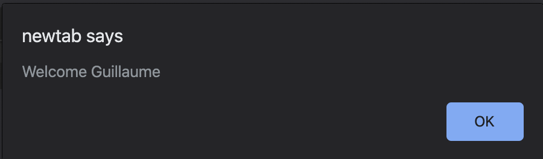



# Requirements

> - Allowed editors: vi, vim, emacs, Visual Studio Code.
> - All your files should end with a new line
> - A README.md file, at the root of the folder of the project, is mandatory
> - Your code should use the js extension

# TASKs

**0. Lexical scoping and welcome message**

File: [0-welcome.js](0-welcome.js/)

Create a function named welcome:

- It takes two arguments: firstName (string) and lastName (string)
- It contains a variable named fullName, that will contains the firstName followed by a space and then the lastName
- Within the welcome function, write a function named displayFullName:
> - It should display an alert with the message Welcome + the variable fullName + and exclamation mark.
> - Call the function displayFullName at the end of the function welcome

### How to test

- Open your web inspector in the tab “Console”
- Copy paste your code
- Run welcome('Holberton', 'School'); should prompt an alert with this content: Welcome Holberton School!
- alert(fullName), should return a reference error fullName is not defined


**1. Closure Scope Chain mandatory**

File: [1-nested_functions.js](1-nested_functions.js/)

- Create a variable named globalVariable with value Welcome
- Create a function outer that:
> - alerts the content of the variable globalVariable
> - creates a variable named course with value Holberton
> - creates a function inner that:
> > - alerts the content of the variable globalVariable and course (concatenated)
> > - creates a variable named exclamation with value !
> > - creates a function inception that alerts the content of the variable globalVariable, course, and exclamation (concatenated)
> > - calls the function inception
> - calls the function inner
- Call the function outer

### Compose the code:

- Write the function inception within inner
- Write the function inner within outer
- Call the function outer in the main code (outside any function)
- Call the function inner within outer
- Call the function inception within inner

### Requirements:

Running the script should display three popups one by one with the text Welcome, Welcome Holberton, and Welcome Holberton!

**2. Closure**

File: [2-function_me.js](2-function_me.js/)

Write a function named welcomeMessage:

- It accepts one argument fullName (string)
- It should be a closure for an alert displaying Welcome <fullName>

After this function definition, create three variables:

- guillaume contains a call welcomeMessage with Guillaume as argument
- alex contains a call welcomeMessage with Alex as argument
- fred contains a call welcomeMessage with Fred as argument

### How to test:

- In your web console, cop/paste your file
- Executing the following in the console:

```sh
guillaume();
alex();
fred();
```

Should display three alerts like below:




**3. Closure and loops**

File: [3-classrooms.js](3-classrooms.js/)

Write a function named createClassRoom:

- It takes into argument numbersOfStudents (number)
- Inside, it contains a function studentSeat, that takes into argument seat (number) and returns a function that returns the seat number
- After the definition of studentSeat, create and populate a variable students (array)
> - Using a loop from 0 to numbersOfStudents, pass the number of iteration + 1 to studentSeat and add its return value to the students array
- Returns the students array
Create a closure classRoom, calling createClassRoom with 10 students

### Requirements:

Executing the following code:

```sh
console.log(classRoom[0]());
console.log(classRoom[3]());
console.log(classRoom[9]());
```

Should return

```sh
1
4
10
```

**4. Complex Closure**

File: [4-math.js](4-math.js/)

Create a function divideBy:

- It takes into argument firstNumber (number)
- It returns a function that takes into argument secondNumber (number)
> - It returns the second number divided by the first number

Create a function addBy:

- It takes into argument firstNumber (number)
- It returns a function that takes into argument secondNumber (number)
> - It returns the sum of the two numbers

Create four closures:

- addBy100, that uses the function addBy with the number 100
- addBy1000, that uses the function addBy with the number 1000
- divideBy10, that uses the function divideBy with the number 10
- divideBy100, that uses the function divideBy with the number 100

### Requirements:

Executing the following code:


```sh
console.log(addBy100(20));
console.log(divideBy10(20));
console.log(divideBy100(200));
console.log(addBy1000(20));
```

Should display in the console:

```sh
120
2
2
1020
```


5. Changing DOM with closure mandatory

File: [5-mode.js](5-mode.js/)

Create a function named changeMode:

- It accepts 5 arguments size (number), weight (string), transform (string), background (string), color (string)
- Using closure, it changes the style of the entire page and set the font-size, font-weight, text-transform, background-color, and color

Write a function named main:

- Set a variable named spooky that passes the arguments 9, bold, uppercase, pink, green to changeMode
- Set a variable named darkMode that passes the arguments 12, bold, capitalize, black, white to changeMode
- Set a variable named screamMode that passes the arguments 12, normal, lowercase, white, black to changeMode
- Add a paragraph to the body of the page with the text Welcome Holberton!
- Add a button to the body with the text Spooky
- Add a button to the body with the text Dark mode
- Add a button to the body with the text Scream mode
- When clicking on each button, the page CSS should change to the different themes you created previously
Call the main function

Requirements:

- Use vanilla javascript to add the elements to the DOM and change the style of the page
- JQuery not allowed!

Clicking the Spooky button should change the web page to look something like this:


Clicking the Dark mode button should change the web page to look something like this:


Clicking the Scream mode button should change the web page to look something like this:


**6. Private methods with closure**

File: [6-hogwarts.js](6-hogwarts.js/)

Write a module named studentHogwarts:

- It contains two variables privateScore set to 0, and name set to null
- It contains one private method changeScoreBy, it takes points in argument and add it to privateScore
- The module gives access to four public methods (return an object):
> - setName, it takes into argument newName, and set the private variable name
> - rewardStudent, it calls the method changeScoreBy with 1
> - penalizeStudent, it calls the method changeScoreBy with -1
> - getScore, it returns name: score (ex: Harry: 14)

Create one variable named harry, that is an instance of studentHogwarts:

- Set the name of the object to Harry
- Reward the student four times
- Log to the console the name and score

Create one variable named draco, that is an instance of studentHogwarts:

- Sets the name of the object to Draco
- Reward the student one time
- Penalize the student three times
- Log to the console the name and score

Requirements:

Executing the code should display in the console

```sh
Harry: 4
Draco: -2
```

**7. Stack order and setTimeout**

Files: [7-timeout.js](7-timeout.js/)

Write the following commands in the following order:

- Log to the console Start of the execution queue
- Log to the console Final code block to be executed using setTimeout (with delay of 0)
- Using a loop that iterates 100 times, each iteration logs to the console the iteration number
- Log to the console End of the loop printing

### Requirements:

- Your code should log to the console the following:

```sh
Start of the execution queue
1
2
...
100
End of the loop printing
Final code block to be executed
```

**8. Stack order in functions**

Files: [8-payments.js](8-payments.js/)

Write a function processPayment:

- It takes one argument amount (number)
- It logs to the console Collecting payment of <amount>

Write a function named processOrder:

- It takes two arguments orderId (number), and amount (number)
- It logs to the console <orderId> is being processed
- It calls the function processPayment
- It logs to the console <orderId> has been fully processed

In the main part of the code:

- Logs to the console Processing orders
- Call processOrder with 12321 and 10.99
- Call processOrder with 12322 and 12.99
- Call processOrder with 12323 and 15.0
- Logs to the console All the orders have been processed

Requirements:

- Your code should log the following to the console

```sh
Processing orders
12321 is being processed
Collecting payment of 10.99
12321 has been fully processed
12322 is being processed
Collecting payment of 12.99
12322 has been fully processed
12323 is being processed
Collecting payment of 15
12323 has been fully processed
All the orders have been processed
```

**9. Prime numbers & timing execution**

Files: [9-prime.js](9-prime.js/)

Write a function named countPrimeNumbers:

- It will return the number of prime numbers from 2 to 100
Log to the console the time in milliseconds to execute the function in this format: Execution time of printing countPrimeNumbers was <time used> milliseconds.

### Requirements:

- You must use performance API to measure the time needed to execute the function (performance.now())
- Your code should display something in the range of Execution time of printing countPrimeNumbers was 0.2700000002514571 milliseconds.

**10. Execution stack & timing execution**

Files: [10-prime.js](10-prime.js/)

Reuse the function countPrimeNumbers from 9-prime.js (copy/paste)

- Execute the function countPrimeNumbers 100 times
- Log to the console the time in milliseconds to execute the function 100 times

### Requirements:

- Your code should display something in the range of Execution time of calculating prime numbers 100 times was 40.865000002551824 milliseconds.

**11. Changing stack order using setTimeout**

Files: [11-prime.js](11-prime.js/)

Reuse the function countPrimeNumbers from 10-prime.js (copy/paste)

- Log to the console the time in milleseconds to execute the function 100 times
- Find a way to actually do most of the calculation at the end of the execution stack

### Requirements:

- Your code should display something in the range of Execution time of calculating prime numbers 100 times was 0.03999999910593033 milliseconds.
- Use setTimeout keyword to change the stack order


**12. Binding**

File: [12-room_area.js](12-room_area.js/)

Create an object named roomDimensions with the following three attributes:

- width: 50
- length: 100
- getArea: function that returns the surface area of a the object using the width and length

Create a variable named boundGetArea, that will bind the object roomDimensions to the getArea function

**13. Binding + Closure**

File: [13-bind_user.js](13-bind_user.js)

Write an object user with the attributes:

- hobby: Calligraphy
- favoriteSport: Hockey
- astrologicalSign: Aries
- firstName: Buillaume
- lastName: Ialva
- location: Telaviv
- occupation: Engineer

Create a function named logWelcomeUser:

- It takes one argument welcomeString (String)
- It logs to the console <welcomeString>, <firstName>. Your occupation is: <occupation>

Create a variable named bindLogWelcomeUser. It binds the logWelcomeUser function to the user object.

Call the function with the string Welcome

### Requirements:

- Calling bindLogWelcomeUser('Hello'); should return Hello, Buillaume. Your occupation is: Engineer

14. Simple callback mandatory

File: [14-wikipedia.js](14-wikipedia.js/)

Write a new function named createElement:

- It accepts one argument data (String)
- It creates a paragraph element
- The content of the paragraph is set to data
- It appends to the document body the paragraph

Create a new function named queryWikipedia:

- It accepts one argument callback (function)
- Using XMLHttpRequest, it get the article of Stack Overflow with the URL https://en.wikipedia.org/w/api.php?format=json&action=query&prop=extracts&exintro&explaintext&redirects=1&titles=Stack%20Overflow&origin=*
- Once the fetch is correctly executed, it calls the callback function with the extract of the API response

Call queryWikipedia with createElement as callback

### Requirements:

- Use vanilla javascript to run the Ajax query (no jQuery or other framework)
- You must not call createElement within queryWikipedia directly

15. Multiple callbacks #advanced

File: [100-stock.js](100-stock.js/)

Create a variable named stock:

- It contains the stock for the items you are selling
- It’s a dictionary with the values macbook: 2 and iphone: 4

Write a new function named processPayment:

- It accepts one argument itemName (String)
- It change the stock, by removing one item of the stock for the item passed in argument
- It logs to the console the text Payment is being processed for item <itemName>

Write a new function named processError:

- It accepts one argument itemName (String)
- It logs to the console the text No more <itemName> in stock
- It logs to the console the text Payment is not being processed

Write a new function named processOrder:

- It accepts three arguments itemName (String), callbackPayment (function), and callbackError (function)
- It logs to the console the text Verifying the stock of <itemName>
- If there is enough stock for the item, it calls callbackPayment
- If there is not enough stock for the item, it calls callbackError

Prompt to the user the message Please enter the item you would like to purchase (Macbook, iPhone) and pass the right callbacks

### Requirements:

- Make sure that the case is not creating a problem (e.g MacBOok should still work)
- Make sure that items that are not offered get the correct message