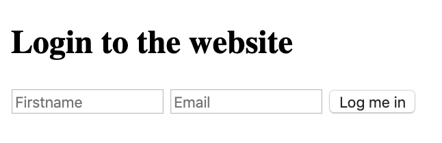



# Requirements

> - Allowed editors: vi, vim, emacs, Visual Studio Code.
> - All your files should end with a new line
> - A README.md file, at the root of the folder of the project, is mandatory
> - Your code should use the js extension
> - All of your code will be compiled/executed on Ubuntu 18.04 using Node 12.x and npm 6.x
> - src/index.js should stay empty - all your Javascript must be in your HTML, inside <script> tag 

# TASKs

**0. Create basic cookie**

Files: [0-index.html](0-index.html/) - [index.js](src/index.js/) - [package.json](package.json/)

### Install your development environment:

- Installwebpack-dev-server by running npm install webpack-dev-server --save-dev (if you have some errors of missing dependencies, install these packages: npm i -D webpack and npm i -D webpack-cli)
- Create an empty file src/index.js
- Run your server with node_modules/.bin/webpack-dev-server

### In a file 0-index.html, create a basic html template:

- Add two text inputs, with the id firstname and email
- Add one button with the text “Log me in” that will call the function setCookies
- Add one button with the text “Show the cookies” that will call the function showCookies
- Create a function setCookies:

> - It should set the cookie firstname with the value in the firstname input
> - It should set the cookie email with the value in the email input
- Create a function showCookies:

> - It should create a DOM element p
> - It should set the inner html with Cookies: and the value of the cookie
> - It should append the paragraph at the bottom of the page

### Requirements:

Try to make your page to look as close to the image below as possible


- Access your code with http://localhost:8080/0-index.html
- Use vanilla javascript to complete the task

### Tips:

- By Tu: If you are using VSCode, you can use the plugin live server

### Repo:

- GitHub repository: holbertonschool-web_front_end
- Directory: 0x0E-Cookies_local_storage
- File: package.json, src/index.js, 0-index.html


**1. Create cookie with expiration date and specific path**

File: [1-index.html](1-index.html/)

### In a file 1-index.html:

- Reuse the code of the previous task
- Modify the way you are setting cookies to expire in 10 days

### Requirements:

- Access your code with http://localhost:8080/1-index.html
- Use vanilla javascript to complete the task


**2. Read cookie**

File: [2-index.html](2-index.html/)

### In a file 2-index.html:

- Reuse the code of the previous task
- Create a function getCookie:
> - It accepts name as argument
> - It should return the value of the cookie with the name passed in argument
> - If the cookie does not exist, it should return an empty string
- Modify the function showCookies:
> - It should display the paragraph Email: EMAIL - Firstname: FIRSTNAME

### Requirements:

- Access your code with http://localhost:8080/2-index.html
- Use vanilla javascript to complete the task


**3. Delete cookie and mini application**

File: [3-index.html](3-index.html/)

in a file 3-index.html, reuse your code from the previous task

add a div in html that will contain the login form:

You can reuse the one you previously wrote
It has one h2
It has two text inputs
It has one button
Write a function named showForm:

It should remove the Welcome message if it exists
It should show the form
Write a function named hideForm:

It should hide the form
Write a function named deleteCookiesAndShowForm:

It should remove the two cookies
it should show the form by calling the showForm function
Write a function named showWelcomeMessageOrForm:

if user is not logged in, the function showForm is called
If the user is logged in, replace the body of the page with a h1
It should display Welcome FIRSTNAME (logout)
(logout) should be a link
The link font should be display in normal weight, italic, and 10px to the right of the message
On click, call the function deleteCookiesAndShowForm, hide the welcome message, and show the form
Requirements:

Access your code with http://localhost:8080/3-index.html
Use vanilla javascript to complete the task
Build the Welcome message with Javascript without using HTML
The login form should look like the image below





**4. HTML function**

File: [4-index.html](4-index.html/)

In a file 4-index.html, reuse the template you created in the previous task. Reuse also the function named createFamilyTree.

- Create a new function replaceFamilyTree:
> - It should replace the childrens of the tbody elements with a new tr
> - The tr element should contain two cells with Gerard and Bonissa in each
- Make sure createFamilyTree and replaceFamilyTree are called

Requirements:

- You must use the keyword html to replace the content of the table

The table created by your script should look like this


**5. Click attribute and remove function**

File: [5-index.html](5-index.html/)

- Remove the createFamilyTree and replaceFamilyTree functions
- Create a function createFamilyTree:
> - It should append to the body an empty table, with thead and two cells with text Firstname and Lastname, respectively
> - It should append an empty tbody element to the table after the thead
- Create a function addNewMember:
> - It accepts two arguments firstName(string) and lastName(string)
> - It appends to the body of the table a new row with three cells
> - The first cell displays the firstName, the second cell displays the lastName
> - The third cell displays (x)
> - On click on the third cell, it should remove the row
> - Add CSS to the third cell to have an orange background
- Calls the function createFamilyTree
- Using addNewMember, generate a fake table with:
> - the first row Guillaume, Salva
> - the second row Arielle, Snizt
> - the third row Fanette, Snizt
> - the fourth row Gerard, Snizt
> - the fifth row Victor, Salva

Requirements:

- You must use the keywords click, css, and remove

The table created by your script should look like this:


**6. Val, before, and prepend functions**

File: [6-index.html](6-index.html/)

- Reuse the function createFamilyTree you wrote in the previous task
- Reuse the function addNewMember you wrote in the previous task, and add the following modification:
> - The function should accept a new argument position(string)
> - When position is equal to before, it should add the row at the top of the table
> - Otherwise, it should add the row at the bottom of the table
- Write a function createForm:
> - It should add before the table two input of type text
> - It should add a select with two options as well: before and after with corresponding Before and After text
> - It should add a input of type submit as well
> > - When the user clicks on the submit, it should call the function addNewMember with the value of the two inputs and the value of the select element
- Call the function createFamilyTree
- Call the function createForm

Requirements:

- You must use the keywords first, before, and prepend
- To select the second input, use the nth-of-type selector

The form created by your script should look like this:


**7. Query - Setup your dev environment**

Files: [7-index.html](7-index.html/)

In a file 7-index.html, reuse the template you created in the previous task

- Remove the functions from the script
- Import jQuery using the CDN and make sure you can access the ajax methods

- Create a form:

> - Create a function createSearchForm, it should append to the body:
> > - An empty input of type text without ID, name, or class
> > - An input of type submit
> > > - When the user clicks on the submit button, it should query the function queryWikipedia that you are going to create with the value of the text input
> > - An empty ul element
- Create a function addNewArticle to add new items to a list

> - It accepts three arguments id(string), title(string), and snippet(string)
> - It create an element li
> > - Within the li, add two paragraph elements
> > > - The first paragraph contains a span tag with the following text: id -, then a b element with the title
> > > - The second paragraph, should contain the snippet
> - Appends the li to the ul element (created by createSearchForm)
- Implement a get function: create a function queryWikipedia

> - It accepts one argument search(string)
> - Create a data object with attributes required to query a search using the string passed in the argument with Wikipedia
> - For each result returned by the API, call the function addNewArticle with the result’s pageid, title, and snippet
- Call the function createSearchForm when the page loads

Requirements:

- Look at the documentation from Wikipedia to query the API https://www.mediawiki.org/wiki/API:Search
- Use the minified only version of jQuery, so you can access the ajax methods
- When adding the snippet, make sure that the HTML coming from Wikipedia is correctly displayed

The form created by your script should look like this:


Query results should display like this:


**8. Pagination**

Files: [8-index.html](8-index.html/)

- Modify the function createSearchForm:

> - It should append to the body another list, with the id pagination

- Modify the function queryWikipedia:

> - Add a new parameter named offset(number)
> - By default, the offset should be set to 0
> - Modify the data object to add the offset
> - When you receive the response from the API, call the function buildPagination that you are going to create below

- Create a new function named buildPagination:

> - It accepts three arguments numberOfItems(number), itemsPerPage(number), and currentOffset(number)
> - When the function is called, reset the pagination list to an empty tag
> - Write a loop that will display the pagination (using the total number of items divided by the number of items per page)
> - For each page, create a list item
> > - Add some CSS for each item (cursor: 'pointer', 10px margin left, and bold when this is the current page)
> > - The text of the item should be the page number
> > - When clicking on a page number, it should call the function queryWikipedia with the right offset

Requirements:

- Use the totalhits value from Wikipedia to define the total number of items
- Display 10 items per page
- Make sure your pages are displayed in an horizontal line

The form created by your script should look like this:


The query results should display like this, notice how the 12 is in bold, because that is the current page


**9. Wrap/unwrap**

Files: [9-index.html](9-index.html/)

In a file 9-index.html, reuse the code from the previous task

- In the header, add some CSS, with the style tag:

> - Add a new class named loading
> > - Set the opacity at 0.2 within that class

- In your script with your other functions, create a function named displayLoading:

> - It accepts one argument loading
> - It select the first ul element of the page
> - If loading is true, it wraps the element with a div tag and the class loading
> - If loading is false, it unwrap the ul from the div

- Modify the queryWikipedia function:

> - It should call the function displayLoading before querying the API
> - Once the API returns the value, it should remove the opacity by calling the function again

Requirements:

- You must use the wrap and unwrap functions of Jquery

How the page should look when results are loading


**10. Another Get API**

Files: [10-index.html](10-index.html/)  -  [db.json](db.json/)

Setup your dev environment

- Install json-server within your projects using npm:
- Run the server using node_modules/.bin/json-server --watch db.json

You are provided with this db.json, don’t forget to push it, you can change the values of the id, title, author, postId, name as you like

```sh
{
  "posts": [
    {
      "id": 1,
      "title": "json-server",
      "author": "typicode"
    },
    {
      "title": "fd",
      "author": "fffff",
      "id": 2
    },
    {
      "title": "fd",
      "author": "fffff",
      "id": 3
    },
    {
      "title": "f",
      "author": "f",
      "id": 4
    },
    {
      "title": "",
      "author": "",
      "id": 5
    },
    {
      "title": "",
      "author": "",
      "id": 6
    },
    {
      "title": "",
      "author": "",
      "id": 7
    },
    {
      "title": "",
      "author": "",
      "id": 8
    },
    {
      "title": "",
      "author": "",
      "id": 9
    },
    {
      "title": "",
      "author": "",
      "id": 10
    }
  ],
  "comments": [
    {
      "id": 1,
      "body": "some comment",
      "postId": 1
    }
  ],
  "profile": {
    "name": "typicode"
  }
}
```
In a file 10-index.html:

- Reuse your template from the previous task, remove the functions in your script and the style in the head
- Make sure you import jQuery using the CDN and make sure you can access the ajax methods

- Create a function addPostRow:

> - It takes into argument data (object)
> - It append to the body a paragraph
> - The paragraph should contain a span element with the text Post created with id ID, title: TITLE, author: AUTHOR
> > - Each variable is contained in the data object

- Create a function named listPosts:

> - It should query your local server on the posts endpoint
> - When the server return a 200 response, it should call the function addPostRow for each element in the response
> - When the server is unavailable, display an alert with the message Server Error

- Call the function listPosts when your page loads

Requirements:

- You must use the get function from jQuery


**11. Post query**

Files: [11-index.html](11-index.html/)  -  [db.json](db.json/)

In a file 11-index.html, reuse the code you previously wrote

- Create a new function buildForm:

> - It appends to the body a form element
> - Inside the form, add a div element, with a label for author with text Author and an input of type text with id author
> - Inside the form, add a div element, with a label for title with text Title and a textarea with id title
> - Inside the form, add an input of type submit
> - When clicking on the submit button, call the function sendForm detailed below

- Create a new function sendForm:

> - It should add after the form, the text About to send the query to the API
> - It should create a data object, with the title and author attributes. The values are the ones within the inputs
> - It should send a POST query to your server endpoint posts with the data
> - If the query succeed, call the function addPostRow with the data coming back > - from the API
> - If the query does not succeed, it should display an alert with the message Error sending the POST query

- Call the functions listPosts and buildForm when your page loads

Requirements:

- When clicking on the label, the input text should be selected by the browser
- When pressing enter on the input text, the form should be submitted without reloading the page
- You must use the after function from jQuery

With the JSON server running, your 11-index.html should look something like this in your browser (does not have to be exactly the same, rows and values depend on what’s in your db.json)


**12. Delete query**

File: [12-index.html](12-index.html/)  -  [db.json](db.json/)

In a file 12-index.html, reuse your code from the previous task

- Modify the function addPostRow:

> - Add an id attribute to the paragraph with row-ID (the ID being the one of the post)
> - Append a span element with the text (delete) to the p, this span should come before the span with the post information
> > - On click, call the function deletePost with the post id

- Create a function deletePost:

> - It accepts one argument id(number)
> - Send a DELETE query to the posts endpoint with the id of the post
> - If the query is successful, remove the row from the body
> - If the query is not successful, display an alert with the message Post was not deleted

### Requirements:

- You must use the function remove from jQuery

With your JSON server running, 12-index.html should look like this in your browser, actual rows and values depend on what’s in your db.json

