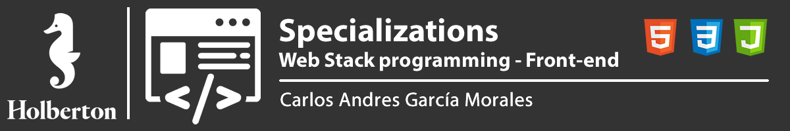

## :orange_book: Web Stack Introduction

A web stack is a compilation of software applications, often needed for web development, especially for developing web applications and implementing websites. A web stack is a type of solution stack, which is a collection of software for performing specific tasks. Web stacks are critical components for web applications as well as websites.

A web stack is also known as a web application stack.

### What is Frontend

Frontend is the part of a program or device that a user can directly access. They are all the web design and development technologies that run in the browser and that are responsible for interactivity with users.

A Frontend programmer must know [HTML, CSS and JavaScript] codes (HTML, CSS and JavaScript) to be able to use some frameworks or libraries that expand their capabilities to create any type of user interface. React, Redux, Angular, Bootstrap, Foundation, LESS, Sass, Stylus and PostCSS are some of them.

## :books: Content

- [0x00-html_advanced](/0x00-html_advanced)
- [0x01-developer_tools](/0x01-developer_tools)
- [0x02-CSS_advanced](/0x02-CSS_advanced)

## :sagittarius: Author

> :man: Carlos Andres Garcia Morales

> :e-mail: [E-mail](agzsoftsi@gmail.com)

> :octocat: [Github](https://github.com/agzsoftsi)

> :bird: [Twiiter](https://twitter.com/karlgarmor)

> :blue_book: [Linkedin](https://twitter.com/karlgarmor)

> :globe_with_meridians: [WebPage](https://www.agzsoftsi.tech/)
